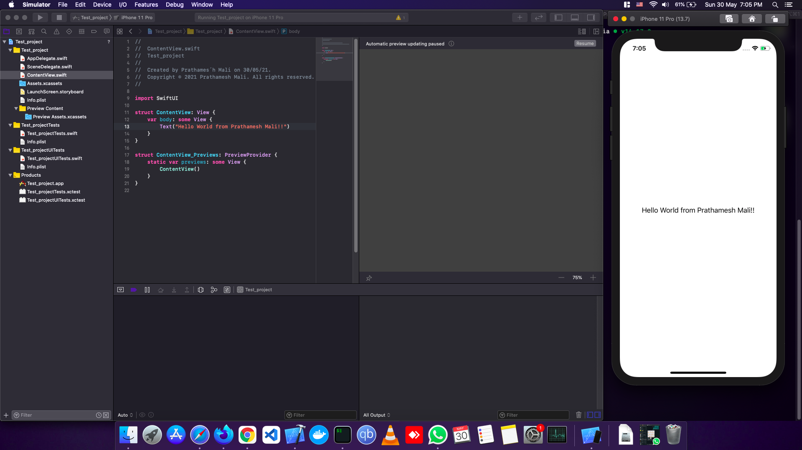

# Hackintosh-ASUS_FX503VD
This is my build Hackintosh for ASUS FX503VD laptop using opencore 0.6.9 with MacOS Catalina

## Specs:

## Product Info:

## Working Xcode

### References and specials thanks to:

[OpenCore guide](https://dortania.github.io/OpenCore-Install-Guide/)

[Dhananjay Bhosale's Guide](https://www.youtube.com/watch?v=jvb-BIMV1Mw&t=2947s&ab_channel=DhananjayBhosale)

[Chris Titus Tech's Guide](https://www.youtube.com/watch?v=eUnVzJsINCI&ab_channel=ChrisTitusTech)
